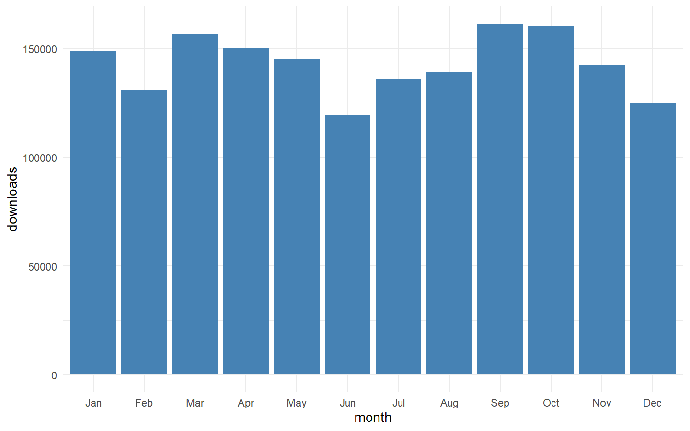
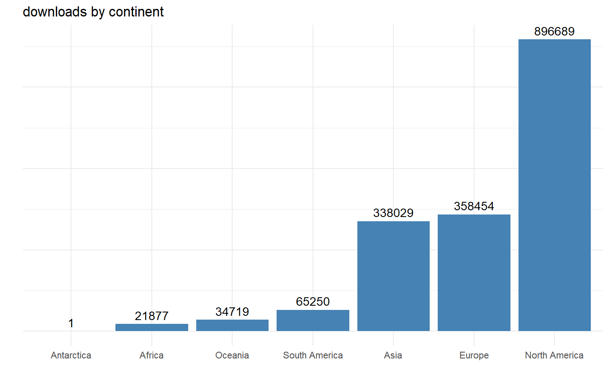

2019 daily R downloads
================
Christopher Maronga
2020-02-08

``` r
# load both datasets (R daily download and af_rstats packages)
load("../00 datasets/cran_rstats_traffic.RDA")

Rdownloads_data <- Rdownloads_data %>% filter(Country_Name != "Missing/Namibia") 
```

## Total downloads monthly

``` r
Rdownloads_data %>% 
  mutate(
    month = month(date, label = T, abbr = T)
  ) %>% group_by(month) %>% 
  summarise(
    downloads = n()
  ) %>% 
  ggplot(aes(month, downloads))+ geom_bar(stat = "identity", fill = "steelblue")
```

<!-- -->

### Total downloads by continent

``` r
Rdownloads_data %>% 
  mutate(
    month = month(date, label = T, abbr = T)
  ) %>% group_by(Continent_Name) %>% 
  summarise(
    downloads = n()
  ) %>% 
  ggplot(aes(reorder(Continent_Name, downloads), 
             downloads))+ geom_bar(stat = "identity", 
                                   fill = "steelblue")+
  theme(axis.text.y = element_blank()) + labs(x = "", title = "downloads by continent", y = "")+
  geom_text(aes(label = downloads), vjust = -0.5)
```

<!-- -->
