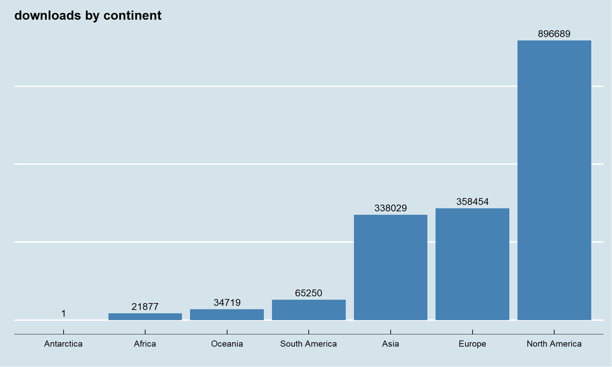

2019 daily R downloads
================
Christopher Maronga
2020-02-09

## Introduction

As any R ethusiast will do, I was curious and wanting to know about the
traffic of R downloads that occur on a daily, weekly and even monthly
basis across the world from [CRAN R](https://cran.r-project.org/)
website. So with that quest, I went on hunting for the relevant data
that I can use to explore where and when do `#rstats` users download the
software and at what frequency around the regions where the software has
grown in popularity.

I finaly got the dataset from [CRAN package download
logs](http://cran-logs.rstudio.com/), which has all the logs for both
package downloads and R daily downloads tracked from October 01, 2012 to
present. Due to the size of the datasets, I only downloaded the logs for
the year 2019, which I intend to explore next.

Throughout the exploration exercise, I make some assumptions about the
data I have:-

  - That a unit download metric is unique(by it’s variables e.g `ip_id`,
    `date`, `time` etc.) check dataset on the website to see full list
    of variables
  - That a download can represent a new user or just an existing user
    updating/downgrading their R software

That being said, I will jump straight to exploring this exciting data
and see what it tells regarding downloads of different R version in the
year 2019.

## Data preparation

The data as contained in the [CRAN package download
logs](http://cran-logs.rstudio.com/) do not contain some useful varibles
such as `country name` or `continent name` and since I need these 2
variables to explore regions and countries, I got a comprehensive list
of ISO Alpha-2 country/continent codes and names from
[DataHub](https://datahub.io/JohnSnowLabs/country-and-continent-codes-list)

I exclude Namibia from the dataset. ISO alpha-2 code for Namibia is `NA`
which is what R uses to identify a missing value, so it was not straight
forward distinguishing `NA` for true missing country code or `NA` for
Namibia, I voided the night mare by simply coding `NA` to mean either
Namibia or missing then excluded the category from the final data used
in exploration.

``` r
library(tidyverse)

# Download country and continent codes ------------------------------------

country_codes <- read_csv("https://pkgstore.datahub.io/JohnSnowLabs/country-and-continent-codes-list/country-and-continent-codes-list-csv_csv/data/b7876b7f496677669644f3d1069d3121/country-and-continent-codes-list-csv_csv.csv")

# use 3-letter code for namibia instead of NA
country_codes <- country_codes %>% 
  mutate(
    Two_Letter_Country_Code = replace(Two_Letter_Country_Code, 
                                      which(Three_Letter_Country_Code == "NAM"), "NAM"),
    
    Country_Name = replace(Country_Name, which(Three_Letter_Country_Code == "NAM"), "Missing/Namibia")
  )
```

The actual code for extracting the logs (it takes a moment to get all
365 dataset, so be patient)

``` r
  start_date <- as.Date('2019-01-01')
  end_date <- as.Date('2019-12-31')

  all_days <- seq(start_date, end_date, by = 'day')

  year <- as.POSIXlt(all_days)$year + 1900
  
  urls <- paste0('http://cran-logs.rstudio.com/', year, '/', all_days, "-r",'.csv.gz')
  
  for (url_id in 1:length(urls)){
    
    data_name <- str_sub(urls[url_id], start_date = 35, end = 44)
  
    dataset <- vroom::vroom(urls[url_id], delim = ",") %>% 
      mutate(
        country = replace(country, which(is.na(country)), "NAM")  # Either missing or belongs to Namibia (NA)
      )
    
    # left join with country codes
    dataset_with_country_name <- dataset %>%   
      left_join(country_codes %>% select(Country_Name, 
                                         Two_Letter_Country_Code, 
                                         Continent_Name),by = c("country" = "Two_Letter_Country_Code")) %>% 
      distinct(date, time, size, version, os, country, ip_id, Country_Name, Continent_Name, .keep_all = T)
    
  # export dataset
    dataset_with_country_name %>% 
      write_csv(paste("00 datasets", "/", "daily_Rdownloads209", "/", data_name, ".csv", sep = ""))
  }
```

## Objectives

I have 2 major aims for this exercise:-

  - Explore the frequency (daily, weekly and monthly) R downloads across
    the represented regions/countries

  - Highligt top downloaded R versions in the year 2019

  - Visualize top 15 countries with highest overal and monthly R
    downloads in each region

  - Use time series analysis techniques to explore trends(daily or
    monthly) R downloads and use the concepts to forecast future R
    downloads for the year 2020 and compare with the actual data when it
    will be available

## Total downloads monthly

``` r
Rdownloads_data %>% 
  mutate(
    month = month(date, label = T, abbr = T)
  ) %>% group_by(month) %>% 
  summarise(
    downloads = n()
  ) %>% 
  ggplot(aes(month, downloads))+ geom_bar(stat = "identity", fill = "steelblue")
```

<!-- -->

### Total downloads by continent

``` r
Rdownloads_data %>% 
  mutate(
    month = month(date, label = T, abbr = T)
  ) %>% group_by(Continent_Name) %>% 
  summarise(
    downloads = n()
  ) %>% 
  ggplot(aes(reorder(Continent_Name, downloads), 
             downloads))+ geom_bar(stat = "identity", 
                                   fill = "steelblue")+
  theme(axis.text.y = element_blank()) + labs(x = "", title = "downloads by continent", y = "")+
  geom_text(aes(label = downloads), vjust = -0.5)
```

<!-- -->
